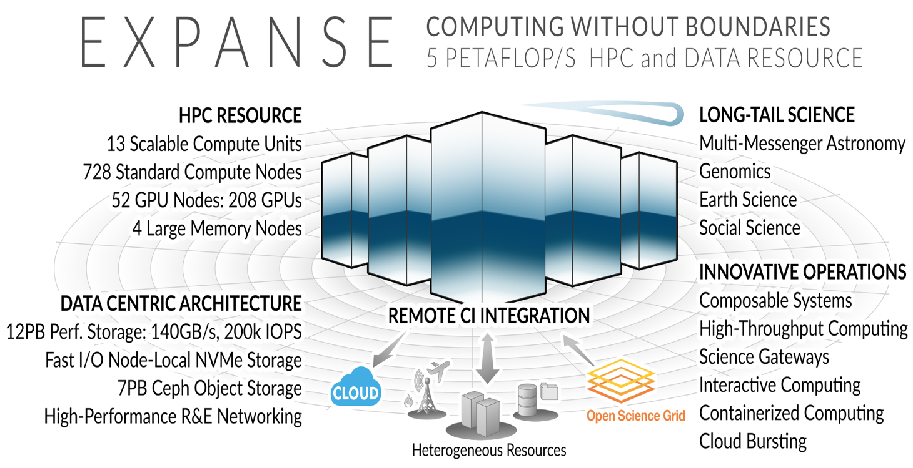
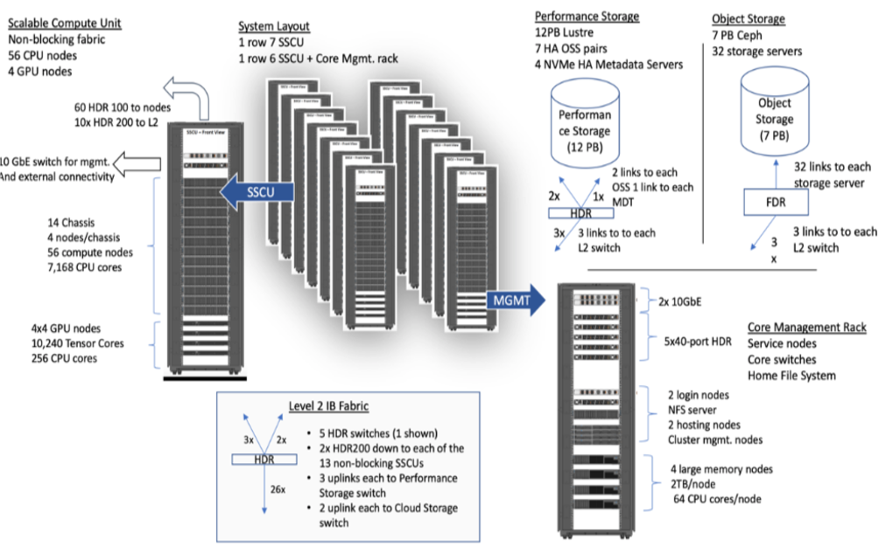
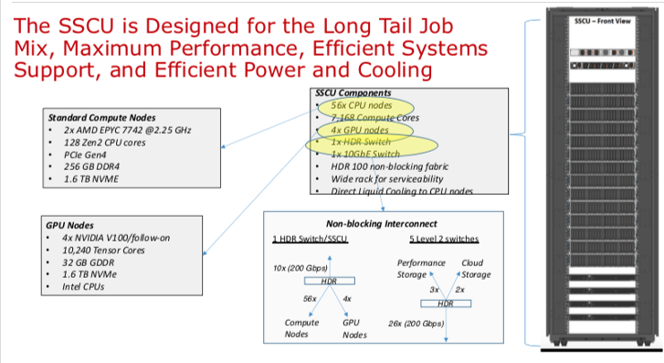
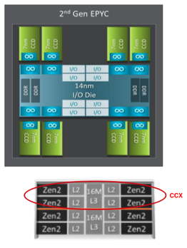
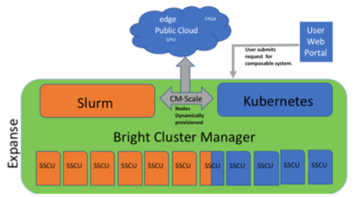
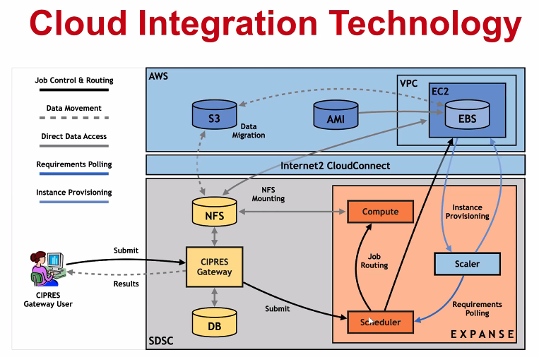

# Getting Started

## HPC for the _long tail_ of science

* Designed by Dell and SDSC delivering 5.16 peak petaflops
* Designed and operated on the principle that the majority of computational research is performed at modest scale: large number jobs that run for less than 48 hours, but can be computationally intensvie and generate large amounts of data.
* An NSF-funded system available through the eXtreme Science and Engineering Discovery Environment \([XSEDE](https://www.xsede.org)\) program.
* Supports interactive computing and science gateways.
* Will offer Composible Systems and Cloud Bursting.

## System Summary

* 13 SDSC Scalable Compute Units \(SSCU\)
* 728 x 2s Standard Compute Nodes
* 93,184 Compute Cores
* 200 TB DDR4 Memory
* 52x 4-way GPU Nodes w/NVLINK
* 208 V100s \| \* 4x 2TB Large Memory Nodes
* HDR 100 non-blocking Fabric
* Storage
  * 12 PB Lustre High Performance
  * 7 PB Ceph Object Storage
  * 1.2 PB on-node NVMe
* Dell EMC PowerEdge
* Direct Liquid Cooled

### Expanse Scaleable Compute Unit

### Expanse Connectivity Fabric

### AMD EPYC 7742 Processor Architecture

* 8 Core Complex Dies \(CCDs\).
* CCDs connect to memory, I/O, and each other through the I/O Die.
* 8 memory channels per socket.
* DDR4 memory at 3200MHz.
* PCI Gen4, up to 128 lanes of high speed I/O.
* Memory and I/O can be abstracted into separate quadrants each with 2 DIMM channels and 32 I/O lanes.
* 2 Core Complexes \(CCXs\) per CCD
* 4 Zen2 cores in each CCX share a16ML3 cache. Total of 16x16=256MB L3 cache.
* Each core includes a private 512KB L2 cache.  

## New Features

### Composable Systems

#### Composable Systems will support complex, distributed, workflows – making Expanse part of a larger CI ecosystem

* Bright Cluster Manager + Kubernetes
* Core components developed via NSF- funded CHASE-CI \(NSF Award \# 1730158\), and the Pacific Research Platform \(NSF Award \# 1541349\)
* Requests for a composable system will be part of an XRAC request
* Advanced User Support resources available to assist with projects - this is part of our operations funding.

[Webinar scheduled for April 2021](https://www.sdsc.edu/education_and_training/training_hpc.html)

### Cloud Bursting

#### Expanse will support integration with public clouds

* Supports projects that share data, need access to novel technologies, and integrate cloud resources into workflows
* Slurm + in-house developed software + Terraform \(Hashicorp\)
* Early work funded internally and via NSF E-CAS/Internet2 project for CIPRES \(Exploring Cloud for the Acceleration of Science, Award \#1904444\)
* Approach is cloud-agnostic and will support the major cloud providers
* Users submit directly via Slurm, or as part of a composed system
* Options for data movement: data in the cloud; remote mounting of file systems; cached filesystems \(e.g., StashCache\), and data transfer during the job
* Funding for users cloud resources is not part of an Expanse award: the researcher must have access to cloud computing credits via other NSF awards and funding

