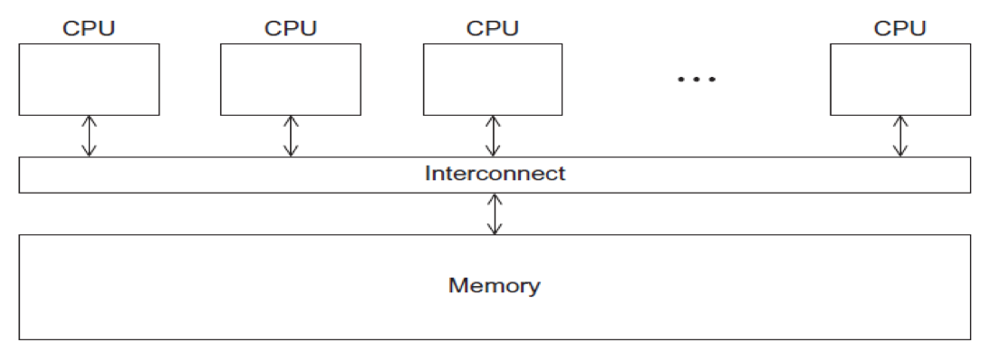

# Running Jobs

## Parallel Models

### Distributed Memory


* Programs that run asynchronously, pass messages for communication and coordination between resources.
* Examples include: SOA-based systems, massively multiplayer online games, peer-to-peer apps.
* Different types of implementations for the message passing mechanism: HTTP, RPC-like connectors, message queues
* HPC historically uses the Message Passing Interface \(MPI\)

### Shared Memory



* CPUs all share same localized memory \(SHMEM\)
  * Coordination and communication between tasks via interprocessor communication \(IPC\) or virtual memory mappings.
* May use: uniform or non-uniform memory access \(UMA or NUMA\); cache-only memory architecture \(COMA\).
* Most common HPC API’s for using SHMEM:
  * Portable Operating System Interface \(POSIX\); Open Multi-Processing \(OpenMP\) designed for parallel computing – best for multi-core computing.

## Methods for Running Jobs

### Batch Jobs

* Batch Jobs are used to submit batch scripts to Slurm from the login nodes. You need to specify
  * Partition \(queue\)
  * Time limit for the run \(maximum of 48 hours\)
  * Number of nodes, tasks per node; Memory requirements \(if any\)
  * Job name, output file location; Email info, configuration
* When you run in the batch mode, you submit jobs to be run on the compute nodes using the sbatch command.
* Remember that computationally intensive jobs should be run only on the compute nodes and not the login nodes.
* Expanse places limits on the number of jobs queued and running on a per group \(allocation\) and partition basis.
* Please note that submitting a large number of jobs \(especially very short ones\) can impact the overall  scheduler response for all users.

### Interactive Jobs

Use the [`srun`](slurm-resource-manager.md#common-commands)command to obtain nodes for real-time command line access to a compute node:



```text
srun --partition=debug --qos=debug-normal --pty --account=abc123 \
     --nodes=1 --ntasks-per-node=128 --mem=248 -t 00:30:00 --wait=0 \
     --export=ALL /bin/bash
```



```
srun --pty --account=abc123 --nodes=1 --ntasks-per-node=1 \
     --cpus-per-task=10  -p gpu-debug --gpus=1  \
     -t 00:10:00 /bin/bash
```



### Command Line Jobs

The login nodes are meant for compilation, file editing, simple data analysis, and other tasks that use minimal compute resources. **Do not run parallel or large jobs on the login nodes** _-_ even for simple tests. Even if you could run a simple test on the command line on the login node, full tests should not be run on the login node because the performance will be adversely impacted by all the other tasks and login activities of the other users who are logged onto the same node. For example, at the moment that this note was written, a `gzip` process was consuming 98% of the CPU time on the Comet HPC system:

```text
    [user@comet-ln3 OPENMP]$ top
    ...
      PID USER      PR  NI  VIRT  RES  SHR S %CPU %MEM    TIME+  COMMAND
    19937 XXXXX     20   0  4304  680  300 R 98.2  0.0   0:19.45 gzip
```

Commands that you type into the terminal and run on the sytem are considered _jobs_ and they consume resources.


Computationally intensive jobs should be run only on the compute nodes and not the login nodes


