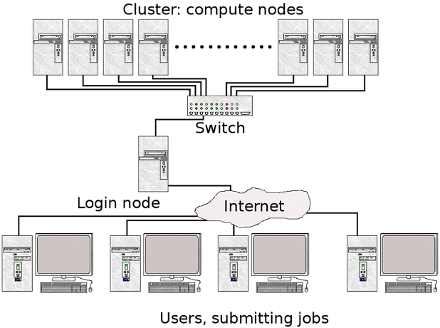

# Slurm Resource Manager

## Overview

Expanse uses the _Simple Linux Utility for Resource Management_ \(Slurm\) resource manager. Slurm is an open source, fault-tolerant, and highly scalable cluster management and job scheduling system for large and small Linux clusters. Follow this link to the [Slurm Quick Start Guide](https://Slurm.schedmd.com/quickstart.html)

| Expanse | Slurm |
| :---: | :---: |
|  |  |
| User logs onto Expanse, and submits a batch script to the Slurm Controller daemon | Slurm parses the batch script for correct syntax and then queues up the job until the requested resources are available |

#### Slurm is the "Glue" for parallel computer to schedule and execute jobs

* Role: Allocate resources within a cluster
* Nodes \(unique IP address\)
* Interconnect/switches
* Generic resources \(e.g. GPUs\)
* Launch and otherwise manage jobs

## Partitions

| Partition Name | Max Walltime | Max Nodes/ Job | Max Running Jobs | Max Running + Queued Jobs | Charge Factor | Comments |
| :--- | :---: | :---: | :---: | :---: | :---: | :--- |
| compute | 48 hrs | 32 | 32 | 64 | 1 | Used for exclusive access to regular compute nodes |
| shared | 48 hrs | 1 | 4096 | 4096 | 1 | Single-node jobs using fewer than 128 cores |
| gpu | 48 hrs | 4 | 4 | 8 \(32 Tres GPU\) | 1 | Used for exclusive access to the GPU nodes |
| gpu-shared | 48 hrs | 1 | 24 | 24 \(24 Tres GPU\) | 1 | Single-node job using fewer than 4 GPUs |
| large-shared | 48 hrs | 1 | 1 | 4 | 1 | Single-node jobs using large memory up to 2 TB \(minimum memory required 256G\) |
| debug | 30 min | 2 | 1 | 2 | 1 | Priority access to compute nodes set aside for testing of jobs with short walltime and limited resources |
| gpu-debug | 30 min | 2 | 1 | 2 | 1 | \*\* Priority access to gpu nodes set aside for testing of jobs with short walltime and limited resources |
| preempt | 7 days | 32 |  | 128 | 0.8 | Discounted jobs to run on free nodes that can be pre-empted by jobs submited to any other queue \(NO REFUNDS\) |
| gpu-preempt | 7 days | 1 |  | 24 \(24 Tres GPU\) | 0.8 | Discounted jobs to run on unallocated nodes that can be pre-empted by jobs submitted to higher priority queues \(NO REFUNDS\) |

## Job State Codes

Slurm has a large number of states. The table below lists some of the most common states you will see. For full details, See the section on Slurm JOB STATE CODES, at the [Slurm Squeue data page](https://Slurm.schedmd.com/squeue.html).

| **STATE** | **LABEL** | **DESCRIPTION** |
| :--- | :--- | :--- |
| CA | CANCELLED | Job was explicitly cancelled by the user or system administrator. |
| C | COMPLETED | job is Complete/Clearing |
| F | FAILED | Job terminated with non-zero exit code or other failure condition. |
| PD | PENDING | Job is awaiting resource allocation. |
| R | RUNNING | Job currently has an allocation. |
| ST | STOPPED | Job has an allocation, but execution has been stopped with SIGSTOP signal. CPUS have been retained by this job. |
| TO | TIMEOUT | Job terminated upon reaching its time limit. |

## Common Commands

Here are a few key Slurm commands. For more information, run the `man Slurm` or see this page:

| **COMMAND** | **DESCRIPTION** |
| :--- | :--- |
| `scancel` | Used to signal or cancel jobs, job arrays or job steps. |
| `sbatch` | Submit a batch script to Slurm. |
| `sinfo` | View information about Slurm nodes and partitions. |
| `squeue` | Used to view job and job step information for jobs managed by Slurm. |
| `srun` | Run a parallel job on cluster managed by Slurm. |

Submit jobs using the sbatch command:

```text
$ sbatch mycode-slurm.sb
```

Submitted batch job 8718049.

Check job status using the squeue command:

```text
$ squeue -u $USER
    JOBID PARTITION     NAME     USER   ST   TIME  NODES  NODELIST(REASON)
  8718049   compute       mycode user   PD   0:00      1        (Priority)
```

Once the job is running:

```text
$ squeue -u $USER
    JOBID PARTITION     NAME     USER    ST     TIME  NODES  NODELIST(REASON)
  8718049     debug   mycode     user     R     0:02      1    expanse-14-01
```

Cancel a running job:

```text
$ scancel 8718049
```

## Example

Below is an example of a batch script that prints our your environment on the compute node:



```bash
#!/bin/bash
#SBATCH --job-name="envinfo"
#SBATCH --output="envinfo.%j.%N.out"
#SBATCH --partition=compute
#SBATCH --nodes=1
#SBATCH --ntasks-per-node=1
#SBATCH --export=ALL
#SBATCH --account=abc123
#SBATCH -t 00:01:00

## Environment
module purge
module load slurm
module load cpu
##  perform some basic unix commands
echo "----------------------------------"
echo "hostname= " `hostname` 
echo "date= " `date` 
echo "whoami= " `whoami` 
echo "pwd= " `pwd` 
echo "module list= " `module list` 
echo "----------------------------------"
echo "env= " `env` 
echo "----------------------------------"
```



```bash
----------------------------------
hostname=  exp-6-56
date=  Wed Oct 7 23:45:43 PDT 2020
whoami=  user
pwd=  /home/user/DEMO/ENV_INFO
Currently Loaded Modules:
  1) slurm/expanse/20.02.3   2) cpu/1.0
----------------------------------
env=  SLURM_MEM_PER_CPU=1024 LD_LIBRARY_PATH=/cm/shared/apps/Slurm/current...
[SNIP]
----------------------------------
```




